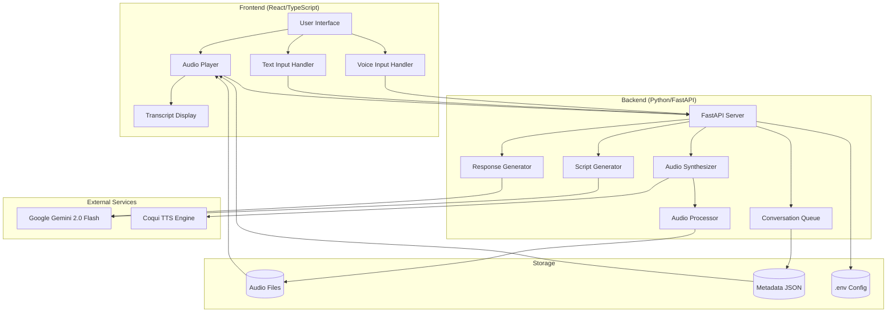

# Design Document: VLSI Audio Overview

## Overview

The VLSI Audio Overview system is a web-based educational tool that generates and plays podcast-style conversations between two AI hosts about VLSI topics. The system consists of three main layers:

1. **Backend (Python/FastAPI)**: Handles dialogue generation, text-to-speech synthesis, and audio processing
2. **Frontend (React/TypeScript)**: Manages audio playback, user interactions, and real-time transcript display
3. **AI Services**: Integrates with Google Gemini 2.0 Flash for content generation and Coqui TTS for voice synthesis

The system supports two interaction modes:
- **Passive listening**: Students play pre-generated audio overviews
- **Active participation**: Students ask questions via voice or text, receiving contextual responses from both AI hosts

## Architecture

### System Architecture Diagram



### Component Responsibilities

**Frontend Components:**
- **Audio Player**: Manages playback state, progress tracking, and audio queue
- **Voice Input Handler**: Captures microphone input using MediaRecorder API
- **Text Input Handler**: Provides fallback text input interface
- **Transcript Display**: Shows real-time synchronized transcript with speaker identification

**Backend Components:**
- **Script Generator**: Creates educational dialogue scripts using Gemini API
- **Response Generator**: Processes student questions and generates contextual responses
- **Audio Synthesizer**: Converts text to speech using Coqui TTS with voice models
- **Audio Processor**: Handles audio format conversion and file management using pydub
- **Conversation Queue**: Manages audio segment sequencing and playback order

**External Services:**
- **Google Gemini 2.0 Flash**: Provides dialogue generation and question answering
- **Coqui TTS Engine**: Generates speech audio from text with custom voice models

## Components and Interfaces

### Backend API Endpoints

#### 1. Generate Audio Overview
```
POST /api/overview/generate
Request: {
  "topic": "FSM Design",
  "duration_minutes": 8-10
}
Response: {
  "overview_id": "uuid",
  "segments": [
    {
      "segment_id": "uuid",
      "speaker": "zoya" | "ravi",
      "text": "string",
      "audio_url": "/audio/{segment_id}.wav",
      "duration": 12.5,
      "sequence": 0
    }
  ],
  "total_duration": 480.0
}
```

#### 2. Submit Voice Question
```
POST /api/question/voice
Request: multipart/form-data
  - audio: File (audio/webm or audio/wav)
  - overview_id: string
  - current_position: number (seconds)
Response: {
  "question_id": "uuid",
  "transcription": "string",
  "response_segments": [
    {
      "segment_id": "uuid",
      "speaker": "zoya" | "ravi",
      "text": "string",
      "audio_url": "/audio/{segment_id}.wav",
      "duration": 8.2,
      "sequence": 0
    }
  ]
}
```

#### 3. Submit Text Question
```
POST /api/question/text
Request: {
  "question": "string",
  "overview_id": "string",
  "current_position": number
}
Response: {
  "question_id": "uuid",
  "response_segments": [
    {
      "segment_id": "uuid",
      "speaker": "zoya" | "ravi",
      "text": "string",
      "audio_url": "/audio/{segment_id}.wav",
      "duration": 8.2,
      "sequence": 0
    }
  ]
}
```

#### 4. Get Audio File
```
GET /audio/{segment_id}.wav
Response: audio/wav binary data
```

### Frontend Components

#### AudioPlayer Component
```typescript
interface AudioPlayerProps {
  overviewId: string;
  segments: AudioSegment[];
  onQuestionRequest: (position: number) => void;
}

interface AudioPlayerState {
  isPlaying: boolean;
  currentSegmentIndex: number;
  currentTime: number;
  totalDuration: number;
  currentSpeaker: 'zoya' | 'ravi';
}
```

#### VoiceInputHandler Component
```typescript
interface VoiceInputHandlerProps {
  overviewId: string;
  currentPosition: number;
  onResponseReceived: (segments: AudioSegment[]) => void;
  onError: (error: Error) => void;
}

interface VoiceInputHandlerState {
  isRecording: boolean;
  isProcessing: boolean;
  hasPermission: boolean;
}
```

#### TranscriptDisplay Component
```typescript
interface TranscriptDisplayProps {
  currentSegment: AudioSegment | null;
  currentSpeaker: 'zoya' | 'ravi';
}
```

### Backend Service Classes

#### ScriptGenerator
```python
class ScriptGenerator:
    def __init__(self, gemini_client: GeminiClient):
        self.gemini_client = gemini_client
    
    async def generate_dialogue(
        self, 
        topic: str, 
        duration_minutes: int
    ) -> List[DialogueSegment]:
        """Generate educational dialogue script using Gemini API"""
        pass
```

#### AudioSynthesizer
```python
class AudioSynthesizer:
    def __init__(self, tts_engine: CoquiTTS):
        self.tts_engine = tts_engine
        self.voice_models = {
            'zoya': 'path/to/zoya_model',
            'ravi': 'path/to/ravi_model'
        }
    
    async def synthesize_segment(
        self, 
        text: str, 
        speaker: str
    ) -> AudioFile:
        """Convert text to speech using Coqui TTS"""
        pass
```

#### ResponseGenerator
```python
class ResponseGenerator:
    def __init__(self, gemini_client: GeminiClient):
        self.gemini_client = gemini_client
    
    async def transcribe_audio(self, audio_data: bytes) -> str:
        """Transcribe student audio using Gemini API"""
        pass
    
    async def generate_response(
        self, 
        question: str, 
        context: str
    ) -> List[DialogueSegment]:
        """Generate contextual response from both AI hosts"""
        pass
```

## Data Models

### Voice Cloning Process

The system uses Coqui TTS for voice cloning to create Zoya's voice from instructor samples:

**Step 1: Prepare Voice Samples**
- Collect 5-10 minutes of instructor voice recordings
- Place samples in `voice_samples/zoya/` directory
- Ensure samples are clear, varied, and representative

**Step 2: Clone Voice Model**
```python
from TTS.api import TTS

# Initialize TTS with a model that supports voice cloning
tts = TTS(model_name="tts_models/multilingual/multi-dataset/your_tts")

# Clone voice from samples
tts.tts_to_file(
    text="Test sentence",
    speaker_wav="voice_samples/zoya/sample_01.wav",  # Reference sample
    file_path="output.wav"
)
```

**Step 3: Use Cloned Voice**
- For Zoya: Use speaker_wav parameter pointing to instructor samples
- For Ravi: Use pre-trained male voice from Coqui TTS models

**Alternative Approach: Fine-tuning**
If better quality is needed, fine-tune a Coqui TTS model on the instructor's voice samples. This requires more computational resources but produces higher quality results.

### AudioSegment
```python
from pydantic import BaseModel
from typing import Literal

class AudioSegment(BaseModel):
    segment_id: str
    speaker: Literal['zoya', 'ravi']
    text: str
    audio_url: str
    duration: float  # seconds
    sequence: int
    created_at: datetime
```

### AudioOverview
```python
class AudioOverview(BaseModel):
    overview_id: str
    topic: str
    segments: List[AudioSegment]
    total_duration: float
    created_at: datetime
    metadata: dict  # Additional context for response generation
```

### QuestionResponse
```python
class QuestionResponse(BaseModel):
    question_id: str
    overview_id: str
    question_text: str
    response_segments: List[AudioSegment]
    timestamp: float  # Position in overview when question was asked
    created_at: datetime
```

### VoiceModel
```python
class VoiceModel(BaseModel):
    model_id: str
    speaker_name: str  # 'zoya' or 'ravi'
    model_path: str
    sample_rate: int
    is_cloned: bool  # True if cloned from samples, False if pre-trained
```

### Configuration
```python
class Config(BaseModel):
    gemini_api_key: str
    audio_storage_path: str
    metadata_storage_path: str
    voice_samples_path: str  # Path to instructor voice samples for cloning
    zoya_voice_model_path: str  # Path to cloned Zoya voice model
    ravi_voice_model_path: str  # Path to pre-trained Ravi voice model
    max_audio_duration: int = 600  # 10 minutes
    tts_sample_rate: int = 22050
```

### Voice Sample Requirements

For voice cloning to work effectively with Coqui TTS, the instructor voice samples should meet these criteria:

**Sample Specifications:**
- **Format**: WAV or MP3
- **Duration**: 5-10 minutes of total audio (can be split into multiple files)
- **Quality**: Clear speech, minimal background noise
- **Content**: Natural speaking, varied intonation
- **Sample Rate**: 22050 Hz or higher

**Directory Structure:**
```
voice_samples/
├── zoya/
│   ├── sample_01.wav
│   ├── sample_02.wav
│   ├── sample_03.wav
│   └── ...
└── ravi/  (optional - can use pre-trained model)
```


## Correctness Properties

A property is a characteristic or behavior that should hold true across all valid executions of a system—essentially, a formal statement about what the system should do. Properties serve as the bridge between human-readable specifications and machine-verifiable correctness guarantees.

### Property 1: Script Duration Bounds

*For any* generated audio overview script, the total duration should be between 8 and 10 minutes (480 to 600 seconds).

**Validates: Requirements 1.2**

### Property 2: Speaker Alternation

*For any* generated dialogue script, no speaker (Zoya or Ravi) should have more than 2 consecutive segments without the other speaker having a turn.

**Validates: Requirements 1.4**

### Property 3: Dialogue Structure Completeness

*For any* generated dialogue script about FSM Design, the script should contain segments that introduce concepts, provide examples, and include student questions (verified by keyword presence or semantic analysis).

**Validates: Requirements 1.5**

### Property 4: Audio Synthesis Completeness

*For any* text segment with speaker assignment, the Audio_Synthesizer should successfully generate an audio file with non-zero duration.

**Validates: Requirements 2.1**

### Property 5: Audio Metadata Completeness

*For any* generated audio segment, the stored metadata should include all required fields: speaker, text, duration, sequence order, and audio file path.

**Validates: Requirements 2.4**

### Property 6: Audio Format Validity

*For any* generated audio file, the file should be in WAV or MP3 format and loadable by the Web Audio API without errors.

**Validates: Requirements 2.5**

### Property 7: Audio Storage Format

*For any* stored audio file, the file format should be either WAV or MP3, and associated metadata should be stored in valid JSON format.

**Validates: Requirements 13.8**

### Property 8: Playback Sequence Integrity

*For any* audio overview with multiple segments, playback should proceed through segments in ascending sequence order, and this order should be maintained even after inserting response segments into the queue.

**Validates: Requirements 3.1, 7.4**

### Property 9: Pause-Resume Round Trip

*For any* playback position, pausing and then resuming should return to the exact same position (within 100ms tolerance).

**Validates: Requirements 3.2, 3.3**

### Property 10: Playback Completion Behavior

*For any* audio overview, when all segments complete playback, the player should stop and reset to the beginning (position = 0, segment index = 0).

**Validates: Requirements 3.6**

### Property 11: Progress Display Completeness

*For any* playback state, the rendered progress UI should contain both elapsed time and total duration information.

**Validates: Requirements 3.4**

### Property 12: Speaker Information Display

*For any* currently playing audio segment, the transcript display should show the speaker's name, a visual indicator distinguishing Zoya from Ravi, and the transcript text of the segment.

**Validates: Requirements 4.1, 4.2, 4.4**

### Property 13: Transcript Synchronization

*For any* playback position, the displayed transcript text should match the text of the currently playing audio segment.

**Validates: Requirements 4.5**

### Property 14: Voice Input Capture

*For any* voice input session where microphone access is granted, speaking should result in captured audio data being sent to the Response_Generator.

**Validates: Requirements 5.3, 5.4**

### Property 15: Recording State Activation

*For any* voice input session, when microphone access is granted, the recording state should become active.

**Validates: Requirements 5.2**

### Property 16: Response Generation Pipeline

*For any* student audio input, the complete response generation pipeline should execute: transcription → response generation → audio synthesis, resulting in response segments with audio files.

**Validates: Requirements 6.1, 6.2, 6.5**

### Property 17: Dual-Speaker Responses

*For any* generated response to a student question, the response should include dialogue segments from both Zoya and Ravi.

**Validates: Requirements 6.3**

### Property 18: Contextual Response Relevance

*For any* student question about the current topic, the generated response should reference or relate to the FSM Design topic context.

**Validates: Requirements 6.4**

### Property 19: Response Insertion Round Trip

*For any* audio overview playback, when a response is inserted: the original playback should pause, the response should play, and then the original playback should resume from the paused position (within 100ms tolerance).

**Validates: Requirements 7.2, 7.3**

### Property 20: Response Queue Insertion

*For any* generated response audio, the response segments should be inserted into the playback queue and played before resuming the original overview.

**Validates: Requirements 7.1**

### Property 21: Multiple Questions Stability

*For any* sequence of student questions during playback, the system should maintain the correct playback position and not lose track of where to resume in the original overview.

**Validates: Requirements 7.5**

### Property 22: Input Method Equivalence

*For any* student question (whether submitted as voice or text), the Response_Generator should process it through the same response generation pipeline and produce equivalent outputs.

**Validates: Requirements 8.2, 8.3**

### Property 23: Text Response UI Elements

*For any* text-based question response, the transcript display should include a "Read Aloud" button.

**Validates: Requirements 8.4**

### Property 24: Loading Indicator Presence

*For any* long-running operation (audio generation, voice processing, response generation), the UI should display a loading indicator while the operation is in progress.

**Validates: Requirements 10.1, 10.2, 10.3**

### Property 25: Wait Time Display

*For any* operation that takes longer than 2 seconds, the UI should display an estimated wait time.

**Validates: Requirements 10.4**

### Property 26: Audio Bitrate Minimum

*For any* generated audio file, the bitrate should be at least 64 kbps to ensure clear speech quality.

**Validates: Requirements 12.3**

### Property 27: Configuration Loading

*For any* system startup, the backend should attempt to read API keys from a `.env` file in the project root.

**Validates: Requirements 14.1**

### Property 28: API Key Validation

*For any* system startup, if required API keys (GEMINI_API_KEY) are missing from the configuration, the system should display an error message indicating which keys are needed.

**Validates: Requirements 14.4, 14.5**

## Error Handling

### Error Categories

1. **External Service Failures**
   - Gemini API unavailable or rate limited
   - Network connectivity issues
   - API authentication failures

2. **Audio Processing Errors**
   - TTS engine failures
   - Audio file corruption
   - Unsupported audio formats

3. **User Input Errors**
   - Microphone access denied
   - Invalid audio input
   - Empty or malformed questions

4. **Playback Errors**
   - Audio file not found
   - Web Audio API failures
   - Buffer underruns

### Error Handling Strategies

#### Gemini API Failures
```python
try:
    response = await gemini_client.generate_content(prompt)
except GeminiAPIError as e:
    logger.error(f"Gemini API failed: {e}")
    raise ServiceUnavailableError(
        "The AI service is currently unavailable. Please try again later."
    )
except RateLimitError as e:
    logger.warning(f"Rate limit exceeded: {e}")
    raise ServiceUnavailableError(
        "Too many requests. Please wait a moment and try again."
    )
```

#### TTS Engine Failures
```python
try:
    audio_file = await tts_engine.synthesize(text, speaker)
except TTSError as e:
    logger.error(f"TTS synthesis failed: {e}")
    # Offer text-only mode as fallback
    return TextOnlyResponse(text=text, speaker=speaker)
```

#### Microphone Access Denied
```typescript
try {
  const stream = await navigator.mediaDevices.getUserMedia({ audio: true });
  setHasPermission(true);
} catch (error) {
  setHasPermission(false);
  setError("Microphone access denied. Please use text input instead.");
  setShowTextInput(true);
}
```

#### Audio Playback Failures
```typescript
audioElement.addEventListener('error', (e) => {
  console.error('Audio playback error:', e);
  setError('Failed to play audio. Click retry to try again.');
  setShowRetryButton(true);
});
```

### Graceful Degradation

1. **Voice Input → Text Input**: If microphone unavailable, automatically show text input
2. **Audio Response → Text Response**: If TTS fails, display text with "Read Aloud" button
3. **Real-time Transcript → Static Transcript**: If synchronization fails, show full transcript
4. **Streaming → Buffered**: If network is slow, buffer more audio before playing

### Error Messages

All error messages should be:
- **User-friendly**: Avoid technical jargon
- **Actionable**: Tell users what they can do
- **Specific**: Indicate what went wrong
- **Consistent**: Use similar language across the application

Examples:
- ✅ "Microphone access denied. Please use the text input below to ask your question."
- ✅ "The AI service is temporarily unavailable. Please try again in a moment."
- ❌ "Error 500: Internal server error"
- ❌ "Failed to initialize MediaRecorder"

## Testing Strategy

### Dual Testing Approach

The system requires both unit testing and property-based testing for comprehensive coverage:

**Unit Tests** focus on:
- Specific examples and edge cases
- Integration points between components
- Error conditions and exception handling
- UI component rendering

**Property Tests** focus on:
- Universal properties that hold for all inputs
- Comprehensive input coverage through randomization
- Invariants that should never be violated
- Round-trip properties (e.g., pause-resume, serialize-deserialize)

### Property-Based Testing Configuration

**Library Selection:**
- **Python Backend**: Use `hypothesis` library for property-based testing
- **TypeScript Frontend**: Use `fast-check` library for property-based testing

**Test Configuration:**
- Minimum 100 iterations per property test (due to randomization)
- Each property test must reference its design document property
- Tag format: `# Feature: vlsi-audio-overview, Property {number}: {property_text}`

**Example Property Test (Python):**
```python
from hypothesis import given, strategies as st
import pytest

# Feature: vlsi-audio-overview, Property 2: Speaker Alternation
@given(st.lists(st.sampled_from(['zoya', 'ravi']), min_size=3, max_size=20))
def test_speaker_alternation(speakers):
    """For any generated dialogue, no speaker should have more than 2 consecutive segments"""
    consecutive_count = 1
    for i in range(1, len(speakers)):
        if speakers[i] == speakers[i-1]:
            consecutive_count += 1
            assert consecutive_count <= 2, f"Speaker {speakers[i]} has {consecutive_count} consecutive segments"
        else:
            consecutive_count = 1
```

**Example Property Test (TypeScript):**
```typescript
import fc from 'fast-check';

// Feature: vlsi-audio-overview, Property 9: Pause-Resume Round Trip
test('pause-resume preserves position', () => {
  fc.assert(
    fc.property(
      fc.float({ min: 0, max: 600 }), // Random position in seconds
      async (position) => {
        const player = new AudioPlayer(mockSegments);
        await player.seekTo(position);
        const beforePause = player.getCurrentPosition();
        
        player.pause();
        player.resume();
        
        const afterResume = player.getCurrentPosition();
        expect(Math.abs(afterResume - beforePause)).toBeLessThan(0.1); // 100ms tolerance
      }
    ),
    { numRuns: 100 }
  );
});
```

### Unit Testing Strategy

**Backend Unit Tests:**
- Test API endpoint request/response formats
- Test error handling for each service failure mode
- Test audio file storage and retrieval
- Test configuration loading and validation
- Test Gemini API client integration
- Test Coqui TTS integration

**Frontend Unit Tests:**
- Test component rendering with different props
- Test user interaction handlers (click, input)
- Test state management and updates
- Test error display and recovery flows
- Test audio player controls
- Test microphone permission handling

### Integration Testing

**End-to-End Flows:**
1. Generate audio overview → Store segments → Play audio
2. Ask voice question → Transcribe → Generate response → Synthesize → Play
3. Ask text question → Generate response → Synthesize → Play
4. Pause during overview → Ask question → Resume after response

**Browser Testing:**
- Test on Chrome 90+ (primary target)
- Test on Edge 90+ (secondary target)
- Verify Web Audio API compatibility
- Verify MediaRecorder API compatibility

### Test Data

**Mock Data:**
- Sample FSM Design dialogue scripts
- Pre-recorded audio segments for testing
- Mock Gemini API responses
- Mock TTS outputs

**Test Fixtures:**
- Valid audio files in WAV and MP3 formats
- Invalid audio files for error testing
- Sample voice recordings for transcription testing
- Configuration files with valid and invalid API keys

### Performance Testing

While not part of the core property testing, the following performance characteristics should be validated:

- Audio generation time: < 5 seconds per segment
- Response generation time: < 5 seconds total
- Audio playback latency: < 100ms
- UI update latency: < 200ms
- Segment transition gaps: < 50ms

These can be measured in integration tests but are not suitable for property-based testing.

